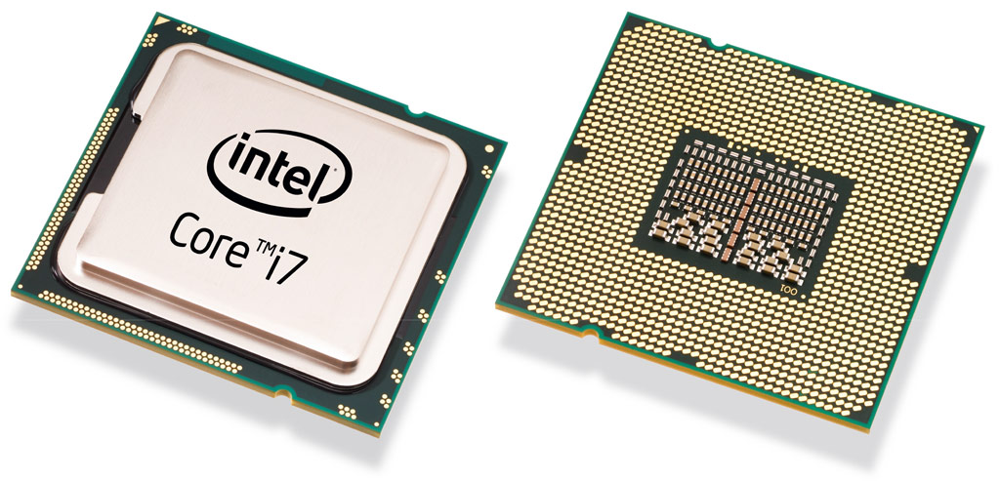
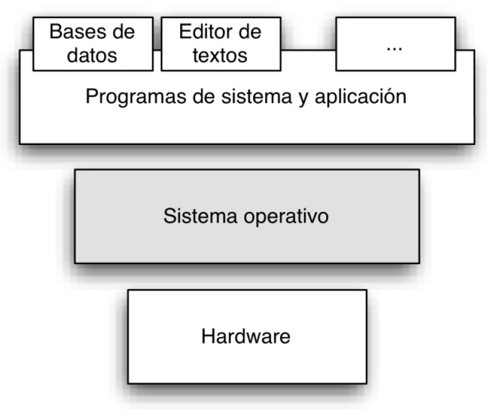
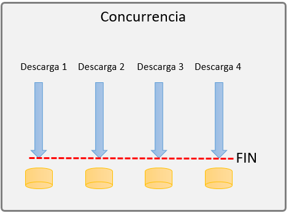
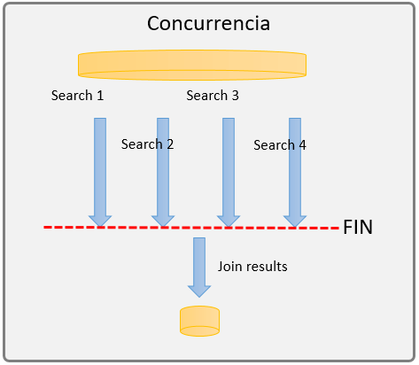
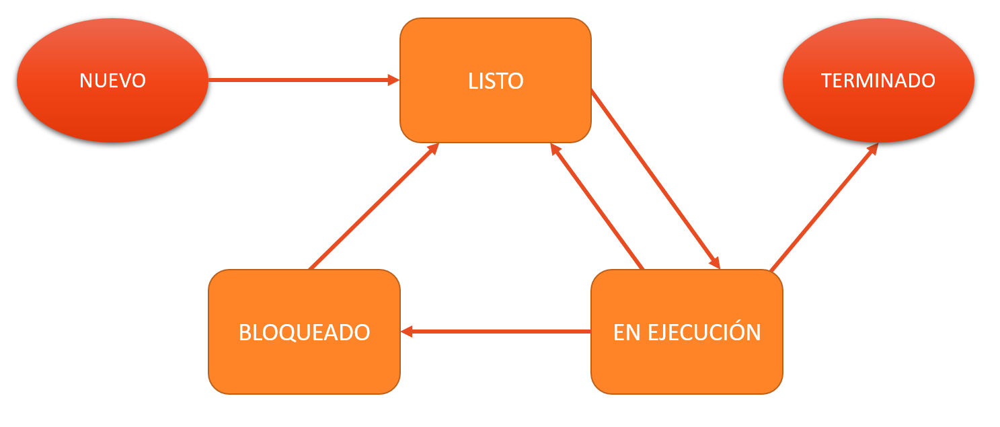
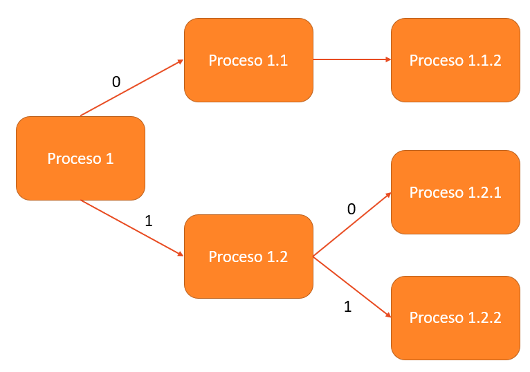

# UT1 - Programación multiproceso

## Objetivos

- Descubrir los sistemas multitarea y sus variantes.
- Enumerar los elementos de los sistemas multitarea.
- Conocer el funcionamiento básico de la gestión de tareas de un sistema operativo.
- Profundizar en el fufncionamiento de los procesos y sus mecanismos de sincronización y comunicación.
- Programar aplicaciones multitarea.

## Contenidos
- [UT1 - Programación multiproceso](#ut1---programación-multiproceso)
  - [Objetivos](#objetivos)
  - [Contenidos](#contenidos)
  - [0. Introducción](#0-introducción)
  - [1. Sistemas multitarea](#1-sistemas-multitarea)
    - [1.1 Procesador](#11-procesador)
    - [1.2 Sistema operativo](#12-sistema-operativo)
      - [Funcionamiento básico del SO](#funcionamiento-básico-del-so)
    - [1.3 Programas, ejecutables, procesos y servicios](#13-programas-ejecutables-procesos-y-servicios)
    - [1.4 Programación concurrente y paralela.](#14-programación-concurrente-y-paralela)
    - [1.5 Programación distribuída](#15-programación-distribuída)
    - [1.6 Hilos](#16-hilos)
    - [1.7 Bifurcación](#17-bifurcación)
  - [2. Procesos](#2-procesos)
    - [2.1 Estados de los procesos](#21-estados-de-los-procesos)
    - [2.2 Comunicación entre procesos](#22-comunicación-entre-procesos)
    - [2.3 Sincronizacción de procesos](#23-sincronizacción-de-procesos)
  - [3. Programación de aplicaciones multiproceso](#3-programación-de-aplicaciones-multiproceso)
    - [3.1 Clase Runtime](#31-clase-runtime)
    - [3.2 Clase ProcessBuilder](#32-clase-processbuilder)
  - [4. Captura de excepciones](#4-captura-de-excepciones)
    - [**throws IOException** / **throws Exception**](#throws-ioexception--throws-exception)
  - [5. Comunicación entre procesos](#5-comunicación-entre-procesos)
  - [Enlaces de interés](#enlaces-de-interés)

## 0. Introducción

Los ordenadores realizan muchas tareas simultáneamente aunque tengan pocos procesadores. En realidad estas tareas no se realizan simultáneamente, se ejecutan una tras otra a velocidades muy altas, sin que podamos apreciarlo.

Hay procesos que realmente son simultáneos, gracias a los procesadores con varios núcleos. Cada núcleo puede ejecutar una instrucción en cada momento, por lo que se podrán ejecutar simultáneamente tantas instrucciones como núcleos tenga el procesador.

Otra solución es utilizar varios ordednadores conectados en red para dividir las tareas. De este modo tendremos varios procesadores con distintos núcleos realizando varios procesos al mismo tiempo.

En esta unidad veremos los fundamentos de la programación multiproceso.

## 1. Sistemas multitarea

Nuestros ordenadores pueden ejecutar varias tareas de forma simultánea, incluso superando el número de unidades de proceso, gracias a la multitarea.

La **multitarea** es la capacidad que tienen nuestros ordennadores de ejecutar varios programas simultáneamente, independientemente del número de unidades de proceso. Esta multitarea puede ser:
- Real: tenemos tantas unidades de proceso como procesos
- Simulada: tenemos menos unidades de proceso que procesos

### 1.1 Procesador
La **unidad central de procesamiento CPU** (Central Processing Unit) o **procesador** es un componente del hardware dentro de un computador, teléfonos inteligentes y otros dispositivos programables.

Su función es interpretar las instrucciones de un programa informático realizanndo operaciones básicas aritméticas, lógicas y externas. Su diseño ha evolucionado desde su creación, aumentando su eficiencia y potencia, y reduciendo aspectos como el consumo de energía y el costo.

Una computadora puede contener más de una CPU (multiprocesamiento). Actualmente, los microprocesadores están constituidos por un único circuito integrado (chip) aunque existen los procesadores multinúcleo, que tienen varias CPU en un solo circuito integrado.

Los componentes de la CPU son:
- **Unidad aritmético lógica (ALU)**: realiza operaciones aritméticas y lógicas.
- **Unidad de control (CU)**: dirige el tráfico de información entre los registros de la CPU y conecta con la ALU las instrucciones extraídas de la memoria.
- **Registros internos**: no accesibles (de instrucción, de bus de datos y bus de dirección) y accesibles de uso específico (contador programa, puntero pila, acumulador, flags, etc.) o de uso general.



Dentro del procesador se encuentran los **núcleos o cores** del mismo, cada uno de los cuales es una unidad de procesamiento que lee las instrucciones y ejecuta las acciones específicas. Todo lo que hacemos con nuestro ordenador es procesado por el procesador y sus núcleos, desde abrir una carpeta, escribir un documento, e incluso navegar en internet.

En el mercado hay muchos procesadores diferentes, podemos encontrarnos procesadores como el Intel i486 SX de 33 MHz y un único núcleo y otros como la serie Intel Core i7 con 2 GHz y cuatro cores.

> Hacer AP1

### 1.2 Sistema operativo

El sistema operativo es un programa que hace de intermediario entre el usuario y las aplicaciones que utiliza y el hardware del ordenador. 
Sus principales funciones son:
- Hacer de interfaz entre el usuario y los recursos del ordenador.
- Permitir utilizar los recursos del computador de forma eficiente.
- Ejecutar los programas del usuario.



Conocemos como **Kernel** a la parte central del sistema operativo responsable de gestionar los recursos del ordenador, permitiendo su uso a través de llamadas al sistema.

#### Funcionamiento básico del SO

El SO funciona en base a interrupciones. Una interrupción es una suspensión temporal de la ejecución de un proceso, para pasar a ejecutar una rutina que trate dicha interrupción.
1. Cuando salta una interrupción se transfiere el control a la rutina de
tratamiento de la interrupción.
2. Mientras se está atendiendo una interrupción, se deshabilita la llegada de nuevas interrupciones.
3. Cuando finaliza la rutina, se reanuda la ejecución del proceso en el mismo lugar donde se quedó cuando fue interrumpido.

### 1.3 Programas, ejecutables, procesos y servicios

Repasamos conceptos:

Un **programa** es un conjunto de instrucciones que se ejecutan en la CPU de manera secuencial para realizar determinadas tareas. Cada **instrucción** es un conjunto de bytes que realiza una tarea concreta.

Los programas antes de ser **ejecutados** deben ser traducidos a un idioma que entienda la máquina. Por ello utilizamos programas externos asociados al lenguaje programación del programa y a la arquitectura del ordenador para majenar la "traducción" de los mismos.

EL proceso de creación de un programa es el siguiente:
1. Se escribe el **código fuente** (conjunto de instrucciones escritas en un determinado lenguaje de programación). 
2. Se compila el código fuente para obtener el **código objeto**.
3. Se genera **código ejecutable** tras enlazar nuestro código objeto con las librerías.
4. El usuario ejecuta el programa ejecutable generando un **proceso**.

Un programa genera un **proceso** al ser ejecutado por un usuario, por lo que podemos decir que un proceso es un programa en ejecución.

Un **servicio** es un programa o aplicación en ejecución en segundo plano, algo con lo que a nivel de usuarios no deberemos interacturar pero que es totalmente necesario para el funcionamiento del sistema, algo que está ahí trabajando pero que no percibimos.


> Hacer AP2

### 1.4 Programación concurrente y paralela.

En los sistemas operativos actuales se pueden tener en ejecución al mismo tiempo múltiples tareas interactivas de diferentes formas:
- Con un único procesador (**multiprogramación**):
    - Si solamente existe un único procesador, solamente un proceso puede estar en un momento determinado en ejecución.
    - El sistema operativo se encarga de cambiar el proceso en ejecución después de un período corto de tiempo (del orden de milisegundos) creando en el usuario la percepción de que múltiples programas se están ejecutando al mismo tiempo (programación concurrente).
    - La programación concurrente no mejora el tiempo de ejecución global de los programas ya que se ejecutan intercambiando unos por otros en el procesador. Sin embargo, permite que varios programas parezca que se ejecuten al mismo tiempo.
- Con varios núcleos en un mismo procesador (**multitarea**): 
    - Cada núcleo podría estar ejecutando una instrucción diferente al mismo tiempo.
    - El sistema operativo se encarga de planificar los trabajos que se ejecutan en cada núcleo y cambiar unos por otros para generar multitarea.
    - Todos los cores comparten la misma memoria por lo que es posible utilizarlos de forma coordinada (programación paralela).
    - La programación paralela permite mejorar el rendimiento de un programa ya que permite que se ejecuten varias instrucciones a la vez.
- Con varios ordenadores distribuidos en red.
    - Cada uno de los ordenadores tendrá sus propios procesadores y su propia memoria (**programación distribuida**).
    - La programación distribuida posibilita la utilización de un gran número de dispositivos de forma paralela, lo que permite alcanzar elevadas mejoras en el rendimiento de la ejecución de programas distribuidos.
    - Como cada ordenador posee su propia memoria, imposibilita que los procesos puedan comunicarse fácilmente, teniendo que utilizar otros esquemas de comunicación más complejos y costosos a través de la red que los interconecte.

Noss vamos a centrar en la **multitarea**, que es capacidad de realizar varias tareas de forma simultánea. Esta multitarea puede suceder de forma concurrente o de forma paralela.

- **Concurrencia**: busca que varios procesos se ejecuten en una misma unidad de proceso alternativamente, haciendo que dichos procesos avances simultáneamente.
- **Paralelismo**: busca dividir un proceso para ejecutar simultáneamente dichas divisiones en distintos núcleos de ejecución.

Ejemplos:

- **Ejemplo de concurrencia**: Una aplicación de descarga de música en la cual puedes descargar un número determinado de canciones al mismo tiempo. Cada canción es independiente de las otras, por lo que la velocidad y el tiempo que tarde en descargarse cada una no afectara al resto de canciones. Esto lo podemos ver como un proceso concurrente, ya que cada descarga es un proceso totalmente independiente del resto.

    

- **Ejemplo de paralelismo**: Imagina la clásica página de viajes, donde nos ayudan a buscar el vuelo más barato o las mejores promociones, para hacer esto, la página debe de buscar al momento en cada aerolínea el vuelo más barato, con menos conexiones, etc. Para esto puedo hacerlo de dos formas, buscar secuencialmente en cada aerolínea las mejores promociones (muy tardado) o utilizar el paralelismo para buscar al mismo tiempo las mejores promociones en todas las aerolíneas.

    

### 1.5 Programación distribuída
El **procesamiento distribuido** busca la ejecución de procesos en unidades de computación independientes que se encuentren sincronizadas y conectadas.

- Más información sobre sistemas distribuídos [aquí](https://adr-rod87.medium.com/qu%C3%A9-es-un-sistema-distribuido-442870a40bc4).

### 1.6 Hilos
Un programa **multihilo** contiene varias partes que se pueden ejecutar simultáneamente.

Cada parte de dicho programa se denomina **hilo (thread)** y cada hilo define una ruta de ejecución independiente. Por lo tanto, multihilo (Multithreaded) es una forma especializada de multitarea.

### 1.7 Bifurcación
Conocemos como bifurcación (fork) a una copia de un proceso. Al proceso original lo llamamos _padre_ y a sus copias _hijos_. El padre y los hijos tienes diferentes identificadores de proceso (PID). 

Vínculo entre procesos:
- Padre: proceso creador.
- Hijo: proceso creado por el proceso padre.

Características de la bifurcación de procesos: 
- Se ejecutan concurrentemente, por lo que ambos procesos comparten la CPU y se irán intercambiando siguiendo la política de planificación del SO.
- Usan espacios de memoria diferentes.
- El proceso padre puede terminar la ejecución del proceso hijo cuando lo crea conveniente.
- **Terminación en cascada**: si el proceso padre termina, en algunos SO no se permite que sus hijos continúen ejecutándose.

## 2. Procesos
Un proceso es la ejecución de un programa, es decir, los datos e instrucciones están cargados en la memoria principal, ejecutándose o esperando a hacerlo. Varios procesos irán avanzando de manera aparentemente paralela, ya que la división del tiempo será a muy pequeña escala, pero en realidad en cada instante concreto solo habrá un proceso en ejecución.

Llamamos **contexto** de un proceso a la información que determina el estado de un proceso en un momento determinado. Para cambiar el proceso que se encuentra en ejecución por otro (cambio de contexto) es necesario seguir los siguientes pasos:
1. Guardar el estado actual del proceso.
2. Determinar el siguiente proceso proceso que va a entrar al procesador.
3. Recuperar y restaurar el estado del nuevo proceso.
4. Continuar con la ejecución del nuevo proceso.

La gestión de los procesos recae sobre el sistema operativo.

Conocemos como **demonio** a un proceso no interactivo que está ejecutándose continuamente en segundo plano. Suele proporcionar un servicio básico para el resto de procesos. El nombre demonio proviene de **deamon**, que a su vez proviene de las siglas inglesas DAEMON ( Disk And Execution Monitor).

### 2.1 Estados de los procesos

Los procesos pueden cambiar de estado a lo largo de su ejecución. Se definen los siguientes estados:
- **Nuevo**: el proceso está siendo creado a partir del fichero ejecutable.
- **Listo**: el proceso no se encuentra en ejecución aunque está preparado para hacerlo. El sistema operativo no le ha asignado todavía un procesador para ejecutarse.
- **En ejecución**: el proceso se está ejecutando. El sistema operativo utiliza el mecanismo de interrupciones para controlar su ejecución.
- **Bloqueado**: el proceso está bloqueado esperando que ocurra algún suceso. Cuando ocurre el evento que lo desbloquea, el proceso no pasa directamente a ejecución sino que tiene que ser planificado de nuevo por el sistema.
- **Terminado**: el proceso ha finalizado su ejecución y libera su imagen de memoria.



Ni el programador ni el usuario puede interferir en los estados de un proceso, dependen únicamente del planificador del SO.

### 2.2 Comunicación entre procesos
La comunicación entre procesos (IPC = Inter-Process Communication) es una función básica de los sistemas operativos. Esta comunicación se establece siguiendo una serie de reglas conocidas como **protocolos de comunicación**. Uno de los protocolos más utilizados es el [TCP-IP](https://es.wikipedia.org/wiki/Modelo_TCP/IP), en el que profundizaremos en esta asignatura.

La comunicación entre procesos se puede realizar de diferentes formas:
- **Utilizando sockets**: un socket es una vía de comunicación bidireccional entre procesos situados en distintas máquinas.
- **Mediante flujos de entrada y salida**: varios procesos pueden escribir y leer información unos en otros.
- **RPC (Remote Process Call)**: consiste en realizar llamadas a procesos que pueden encontrarse en ejecución en otras máquinas.
- **Utilizando sistemas de persistencia**: lectura y escritura en diferentes sistemas de persistencia como un archivo o una base de datos.
- A través de **servicios proporcionados a través de internet** (transferencia FTP).

### 2.3 Sincronizacción de procesos
Ejemplo de sincronización entre procesos:



- Si el código de finalización del _proceso 1_ es 0, se ejecuta el _proceso 1.1_
  - Al finalizar el _proceso 1.1_ se ejecuta el proceso _1.1.2_. Independientemente del código de finalización.
- Si el código de finalización del _proceso 1_ es 1, se ejecuta el _proceso 1.2_.
  - La ejecución de los _procesos 1.2.1_ y _1.2.2_ depende del código de finalización del _proceso 1.2_.

Para gestionar el flujo de trabajo entre procesos se necesitan las siguientes herramientas:
- Ejecución: una forma de ejecutar procesos desde otro proceso.
- Espera: una forma de pausar la ejecución de un proceso.
- Generación de código de terminación al finalizar un proceso.
- Obtención de código de terminación de otro proceso.

Para realizar estas funciones en Java contamos con las siguientes clases y métodos:

| Mecanismo                               | Clase         | Método   |
| ----------                              | --------      | --------- |
| Ejecución                               | Runtime       | exec()    |
| Ejecución                               | ProcessBuilder| start()   |
| Espera                                  | Process       | waitFor()   |
| Generación de código de terminación     | System        | exit(valor_retorno)    |
| Obtención de código de terminación      | Process       | waitFor()    |

- **Ejemplo 1**: proceso en Java que devuelve un código de finalización utilizando el método _exit_.

```Java
package ejemplo1;

public class ProcesoSecundario {

    public static void main(String[] args) {
        System.out.println("Ejecutando proceso secundario");
        System.exit(103);
    }

}
```
A continuación se muestra un proceso principal que ejecuta el anterior mediante el método _exec_ y queda a la espera de su finalización. Después recoge el valor de finalización del proceso y toma una decisión en consecuencia.

```Java
package ejemplo1;

public class ProcesoPrincipal {

    public static void main(String[] args) {
        try {
            String[] infoProceso = {"java", "ejemplo1.ProcesoSecundario"};
            Process proceso = Runtime.getRuntime().exec(infoProceso);
            int valorRetorno = proceso.waitFor();
            if (valorRetorno == 0) {
                System.out.println("El proceso ha finalizado correctamente");
            } else {
                System.out.println("El proceso ha fallado. Código de error: " + valorRetorno);
            }
        } catch (Exception e) {
            e.printStackTrace();
        }
    }

}
```
El retorno de este proceso será:
```
El proceso ha fallado. Código de error: 103
```

> Hacer AP3

## 3. Programación de aplicaciones multiproceso

Para programar aplicaciones multiproceso necesitamos:
- Poder lanzar un proceso y y darle parámetros de entrada.
- Poder crear esperas de finalización de procesos.
- Poder guardar el código de finalización de un proceso.
- Tener acceso a los datos generados por los procesos creados.

En Java podemos crear procesos con las clases **Runtime** y **ProcessBuilder** que forman parte del paquete de clases para la gestión de procesos llamado **java.lang**.
- java.lang.Runtime
- java.lang.ProcessBuilder

### 3.1 Clase Runtime
Cada aplicación java que se ejecuta dispone de una instancia de la clase Runtime que representa el entorno de ejecución de la aplicación.
- **.getRuntime()**: devuelve el objeto Runtime asociado con la aplicación Java en curso.
- **.exec(String comando)**: ejecuta la orden especificada en comando. Ésta puede ser cualquier comando del SO.

```Java
// Ejecuta notepad
Runtime.getRuntime().exec("Notepad.exe");
```
En ocasiones, los procesos que ejecutemos necesitarán parámetros de inicio. Al método _exec_ le podemos pasar una cadena de caracteres (String) donde podemos indicar los parámetros separados por espacios.
```Java
// Ejecuta el bloc de notas indicando que se debe abrir o crearse el fichero datos.
Runtime.getRuntime().exec("Notepad.exe datos.txt");
```
Es bastante común crear un objeto tipo _String_ con los parámetros a pasar al método _exec_.
```Java
String[] infoProceso = {Notepad.exe","datos.txt};
Runtime.getRuntime().exec(infoProceso);
```
Lo siguiente que nos interesa es poder gestionar los procesos que ejecutemos. Para ello debemos obtener la referencia a la clase _**Process**_. Con este objeto tendremos acceso a los métodos que nos permiten conocer el estado del proceso en ejecución.
```Java
String[] infoProceso = {Notepad.exe","datos.txt};
Process proceso = Runtime.getRuntime().exec(infoProceso);
```
Si queremos conocer el estado de finalización del proceso necesitamos esperar a que esto suceda y recoger el código de finalización del mismo mediante el método _**waitFor**_. Con este método bloqueamos la ejecución del proceso padre hasta la finalización del hijo.
```Java
String[] infoProceso = {Notepad.exe","datos.txt};
Process proceso = Runtime.getRuntime().exec(infoProceso);
int retorno = proceso.waitFor();
System.out.println("El proceso ha finalizado: " + retorno);
```
La clase _**Process**_ representa el proceso n ejecución y nos permite obtener información sobre este. Métodos más importantes de la clase _java.lang.Process_:

| Método            | Función       | 
| ---               | ---           | 
| destroy()         | Termina el subproceso       | 
| isAlive()         | Devuelve true si el proceso está activo |
| waitFor()         | Hace esperar a un programa hasta que el proceso indicado haya terminado |
| exitValue()       | Devuelve el valor de salida del subproceso | 
| getErrorStream()  | Proporciona un InputStream conectado a la salida de error del proceso |
| getInputStream()  | Proporciona un InputStream conectado a la salida normal del proceso |
| getOutStream()    | Proporciona un OutputStream conectado a la entrada normal del proceso |

Para consultar más información sobre las clases y métodos de la clase Process se puede visitar la documentación oficial del API de Java: [https://docs.oracle.com/javase/8/docs/api/java/lang/Process.html](https://docs.oracle.com/javase/8/docs/api/java/lang/Process.html)

> Ejemplo: Creación de procesos con Runtime (Ejemplo2 21)

### 3.2 Clase ProcessBuilder
Fue añadida en la versión 1.5 de JDK. Supuso una nueva forma de creación y ejecución de procesos del SO.
Gestiona una colección de atributos de proceso.
- Método **.start()**:
	- Crea una nueva instancia de Process con los atributos.
	- Puede ser invocado varias veces desde la misma instancia para crear nuevos subprocesos con atributos idénticos o relacionados.

```Java
// Ejecuta notepad
new ProcessBuilder("Notepad.exe");
```
Para lanzar el proceso ysamos el método _strat()_.
```Java
// Ejecuta el bloc de notas indicando que se debe abrir o crearse el fichero datos.
new ProcessBuilder("Notepad.exe").start();
```
En este caso también podemos agregar parámetros al proceso
```Java
new ProcessBuilder("Notepad.exe","datos.txt").start();
```
Con la clasee ProcessBuilder también podemos obtener valores de retorno de un proceso para sincronizarlos y gestionarlos.
```Java
Process proceso = new ProcessBuilder("Notepad.exe","datos.txt").start();
int retorno = proceso.waitFor();
System.out.println("El proceso ha finalizado: " + retorno);
```
Con el método start podems crear varios subprocesos con una única instancia. Vamos a crear diez instancias del Notepad.
```Java
ProcessBuilder procesos = new ProcessBuilder("Notepad.exe");
for (int i=0;i<10;i++){
    procesos.start();
}
```
La clase ProcessBuilder dispone de más métodos importantes para la gestión de procesos:

| Método            | Función       | 
| ---               | ---           | 
| start             | Inicia un nuevo proceso       | 
| command           | Permite obtener y asignar el programa y los argumentos de la instancia de ProcessBuilder |
| directory         | Asigna u obtiene un directorio de trabajo |
| environment       | Da info sobre el entorno de ejecución |
| redirectError     | Fija el destino de la salidad de error |
| redirectInput     | Fija el origen de la entrada estándar |
| redirectOutput    | Fija el destino de la salida estándar |

Ejemplo: Creación de procesos con ProcessBuilder (Ejemplo1 21)

## 4. Captura de excepciones
Las excepciones lanzadas por un método que pueda hacerlo deben recoger en bloque try/catch o try/finally.
- **try**: Incluye el bloque de código donde se prevé que se genere una excepción.
- **catch**: Incluye el código que se ejecuta cuando se produce la excepción.
- **finally**: Es el bloque de código que se ejecuta siempre, haya o no excepción.

```Java
try{
  // Sentencias Java
}
catch(tipoExcepcion nombreVariable){
  // Sentencias Java
}
```
### **throws IOException** / **throws Exception**
Gestiona las excepciones desde el método main sin necesidad de usar try/catch

Importamos java.io.* para incluir todo el paquete Input/Output
```Java
import java.io.*;
```
## 5. Comunicación entre procesos
Cada proceso
- **Entrada estándar** (stdin): lugar donde el proceso lee los datos de entrada que requiere para su ejecución. `System.in`
- **Salida estándar** (stdout): sitio donde el proceso escribe los resultados que obtiene. `System.out`
- **Salida de error** (stderr): sitio donde el proceso envía los mensajes de error. `System.err`

Cuando se ejecuta un proceso hijo invocado desde un proceso padre, el hijo no puede utilizar su entrada o salida estándar. Por ello tenemos que redirigir su entrada, salida y flujo de error a los del padre para obtener dicha información.

- `OutputStream`: flujo de salida del proceso hijo. Describe la salida del flujo y se utiliza para escribir datos en un archivo, imagen, audio, etc. Por lo tanto, OutputStream escribe datos en el destino de uno en uno.
- `InputStream`: flujo de entrada del proceso hijo. Describe la entrada de flujo y se usa para leer datos de la fuente de uno en uno.
- `ErrorStream`: flujo de error del proceso hijo. El stream está conectado a la salida estándar (stderr) del proceso hijo. Sin embargo, hay que saber que en java stderr y stdout están conectados al mismo sitio.
  - Utilizamos `redirectErrorStream(boolean)` de la clase ProcessBuilder para separarlos.

Se utiliza para ver la salida del proceso hijo en la salida estándar del proceso padre.

Ejemplo de comunicación entre procesos en Java:
```Java
public class Ejemplo6 {

    public static void main(String[] args) {
        try {
            Process process = new ProcessBuilder(args).start();
            InputStream is = process.getInputStream();
            InputStreamReader isr = new InputStreamReader(is);
            BufferedReader br = new BufferedReader(isr);
            String line;
            System.out.println("Salida del proceso" + Arrays.toString(args));
            while ((line = br.readLine()) != null) {
                System.out.println(line);
            }
        } catch (IOException ex) {
            Logger.getLogger(Ejemplo6.class.getName()).log(Level.SEVERE, null, ex);
        }
    }
}
```

> AP4

> Ejemplo de como enviar datos a la entrada estándar del hijo a través del padre utilizando `OutputStream`. (ejemplo 8)

> AP5

Si lo que queremos es redireccionar la salida estándar (o el flujo de error) del proceso hijo a otro lugar que no sea la salida estándar del padre, se hace de la siguiente manera:
- `procesoHijo.redirectOutput(File f)`
- `procesoHijo.redirectInput(File f)`
- `procesoHijo.redirectError(File f)`

> Hacer ejercicios

## Enlaces de interés

- [Documentación de Java sobre concurrencia](https://docs.oracle.com/javase/tutorial/essential/concurrency/)


