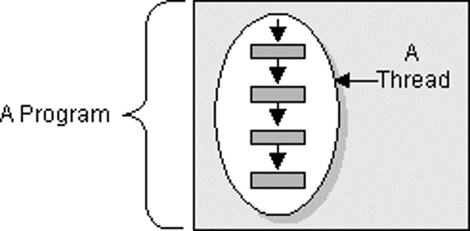
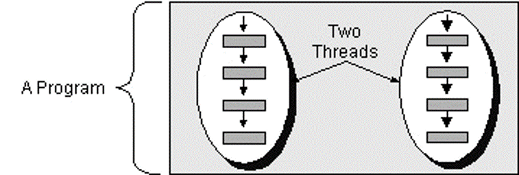
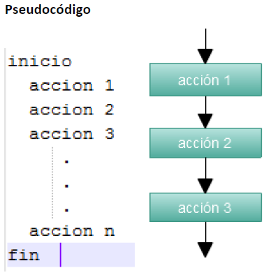
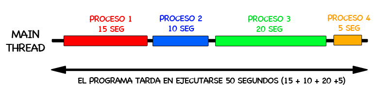
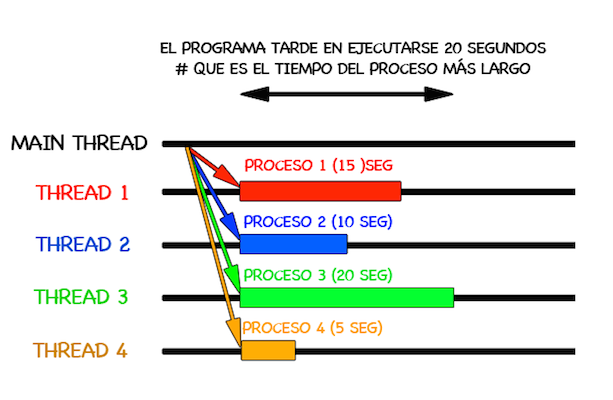
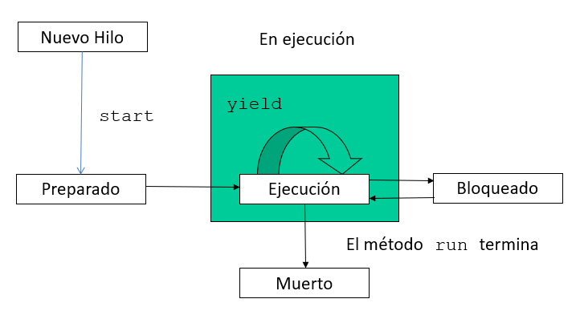
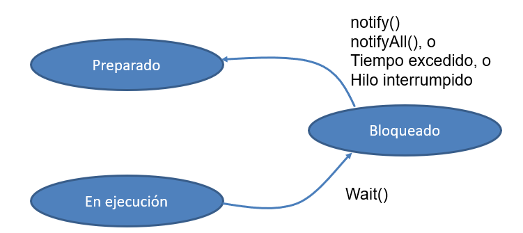

# UT2 - Programación multihilo

- [UT2 - Programación multihilo](#ut2---programación-multihilo)
  - [Objetivos](#objetivos)
  - [0. Introducción](#0-introducción)
    - [Multitarea basada en procesos](#multitarea-basada-en-procesos)
    - [Multitarea basada en hilos](#multitarea-basada-en-hilos)
    - [Hilos](#hilos)
  - [1. Fundamentos de la programación multihilo](#1-fundamentos-de-la-programación-multihilo)
    - [1.1 Programación secuencial (un hilo)](#11-programación-secuencial-un-hilo)
    - [1.2 Programación concurrente (multihilo)](#12-programación-concurrente-multihilo)
    - [1.3 Estados de los hilos](#13-estados-de-los-hilos)
    - [Sleep](#sleep)
    - [Join](#join)
  - [2. Sincronización de hilos](#2-sincronización-de-hilos)
    - [2.1 Región crítica](#21-región-crítica)
    - [2.2 Monitores (productor-consumidor)](#22-monitores-productor-consumidor)

## Objetivos

- Conceptos de hilo y asincronía y su utilidad en programación.
- Características y utilidades de los hilos.
- Aplicación de la rogramación multihilo y técnicas de programación.
- Paquetes y clases más simportantes para la programación multihilo.
- Programación de aplicaciones multihilo.

## 0. Introducción

Un __hilo__ es la unidad básica de utilización de la CPU, y más concretamente de un core del procesador. Así un __thread__ se puede definir como la secuencia de código que está en ejecución, pero dentro del contexto de un proceso.

__Hilo vs Proceso__: hemos visto que el sistema operativo gestiona procesos, asignándoles la memoria y recursos que necesiten para su ejecución. En este sentido, el sistema operativo planifica únicamente procesos

Podemos encontrar dos formas de realizar multitarea (multitasking). 
- multitarea basada en procesos
- multitarea basada en hilos

### Multitarea basada en procesos

Un proceso es un programa que se está ejecutando. La multitarea basada en procesos es la característica que le permite a la computadora ejecutar dos o más programas concurrentemente. 

Los procesos son tareas pesadas que necesitan su propio espacio de direccionamiento. La comunicación entre procesos es más cara y limitada y resulta costoso el cambio de contexto de un proceso a otro. 

### Multitarea basada en hilos

La multitarea basada en hilos requiere menos sobrecarga que la multitarea basada en procesos. 

Los hilos son más ligeros, ya que comparten la memoria y todos los recursos del proceso al que pertenecen. Por lo tanto la creación de nuevos hilos no supone una reserva adicional de memoria.

La comunicación entre hilos es ligera ya que no necesitan ningún mecanismo adicional para comunicarse información entre ellos ya que todos pueden ver la información que hay en la memoria del proceso. 
Se necesitan mecanismos de sincronización adicionales para evitar problemas de acceso.

Ejemplos utilización de hilos:
- Pestañas abiertas del navegador Google Chrome
- Word tiene un hilo comprobando automáticamente la gramática a la vez que está escribiendo un documento.
- Diferentes personajes de un videojuego moviéndose e interactuando independientemente.

### Hilos

Un hilo es un único flujo de control dentro de un programa. Algunas veces es llamado contexto de ejecución porque cada hilo debe tener sus propios recursos.

Dos hilos puede ejecutarse a la vez. Dos hilos concurrentes están en progreso, o intentando obtener tiempo de ejecución de la CPU al mismo tiempo, pero no necesariamente de forma simultánea.

Un hilo comparte con otros hilos la sección de código, datos, memoria y los archivos abiertos.
Cada hilo tiene un contador de programa, un conjunto de registros de CPU y la [pila de ejecución](https://es.wikipedia.org/wiki/Pila_de_llamadas).

## 1. Fundamentos de la programación multihilo

Un programa multihilo contiene dos o más partes que pueden ejecutarse de forma concurrente o secuencial.

Cada parte de ese programa se llama hilo (Thread) y cada hilo establece un camino de ejecución independiente.

Los programas con un único hilo se ejecutan de forma secuencial mientras que los programas multihilo pueden ejecutarse de manea concurrente.

Características principales de los hilos:
- Dependencia del proceso: no se pueden ejecuatar independientemente.
- Ligereza: optimizan la utilización de recursos. Podemos crear muchos hilos sin tener pérdidas de memoria.
- Comparten recursos: Dentro de un proceso los hilos comparten espacio de memoria. Esto puede producir __errores de concurrencia__.

### 1.1 Programación secuencial (un hilo)

> __Ejemplo 1__: Veremos un programa en Java que muestra como cualquier programa se ejecuta mediante un hilo. En el programa se declara un objeto de tipo Thread y se recupera la referencia mediante el método currentThread(). Una vez creado el hilo se puede pedir el nombre o cambiarlo o dormirlo o ver su prioridad…. 

### 1.2 Programación concurrente (multihilo)

La concurrencia reúne varios hilos de ejecución.

Cualquier programa a ejecutarse es un proceso que tiene un hilo de ejecución principal, este hilo puede a su vez crear nuevos hilos.

Para crear hilos se puede hacer de dos modos:
- Extendiendo de la clase java.lang.Thread.
- Implementando la interfaz java.lang.Runnable. Suele utilizar una instancia a la clase Thread.

> __Ejemplo 2__: Vemos un ejemplo de cómo se crean dos hilos extendiendo de la clase thread. La clase que implementa al hilo extiende de Thread. Se definen los constructores y un método run y se crean los hilos.Para lanzar los hilos se utiliza el método start.

Explicación del ejercicio 2:

- Al llamar a start el hilo se registra en el planificador de hilos de Java. Este decide que hilo ha de ejecutarse en cada momento.
- El planificador suele utilizar política [FIFO](https://es.wikipedia.org/wiki/First_in,_first_out).
- Start no significa que se ejecute el hilo, si no que lo pone en estado preparado-para-ejecución.
- Cada hilo compite para entrar a ejecutarse.
- A priori, no se sabe que hilo va a ejecutarse antes.

> __Ejemplo 3__: Ejemplo de cómo se crean hilos mediante la interfaz Runnable. Veremos el mismo ejemplo de antes pero con la interfaz Runnable.

Normalmente trabajaremos utilizando directamente la clase Thread. Runnable se utiliza si la clase ya extiende de otra. 

### 1.3 Estados de los hilos

- Estado __nuevo__: el hilo se ha creado, se ha hecho el new(), pero no se ha invocado a start().
- Al invocar a start() pasa a __preparado__ para ejecutarse.
- Al entrar en la CPU, pasa al estado __ejecución__.
- __Bloqueado__: el hilo no se ejecuta porque está a la espera de un evento. Cuando sucede el evento, pasa a preparado para ejecutarse. Se puede bloquear por dos motivos:
    - __Dormido__: se bloquea por un tiempo determinado.
    - __Esperando__: se bloquea esperando la llegada de un evento. Puede ser la recepción de un mensaje, la finalización de una tarea de E/S o acceso a un método sincronizado.
- __Muerto__: Pasa a este estado cuando finaliza su método run() o recibe un mensaje interrupt(). De este estado no puede ir a ningún otro estado.

### Sleep
> Ejemplo 4
### Join
> Ejemplo 5

## 2. Sincronización de hilos
Todos los hilos de un programa pertenecen a un mismo proceso, por lo que comparten variables y objetos en memoria. Si varios hilos manipulan objetos comunes, puede llevar a resultados erróneos. Para solucionar esto es necesario sincronizar. 

Existen varios mecanismos de sincronización:
- Región crítica
- Monitores
- Semáfotos

### 2.1 Región crítica
La región critica de un programa multihilo es el bloque de código que accede a recursos compartidos, por lo que limitaremos el acceso a esta sección a un único hilo en ejecución.

Es importante determinar correctamente la sección crítica para evitar errores de concurrencia. Además es importante hacerlo eficientemente para aprovechar el paralelismo.

> __Ejemplo 6a__: programa que crea cuatro hilos que acceden a una variable contador. Cada uno de los hilos aumenta el contador en una unidad. No usa herramientas de sincronización. ¿Funciona correctamente?

Para sincronizar un proceso se utiliza la palabra reservada __Synchronized__.
La región crítica (la zona a proteger) se puede crear en el método o en el objeto.

> __Ejemplo 6b__: Modificamos el ejemplo anterior y sincronizamos el método protegiendo la región crítica mediante la palabra clave Syncronized.

> __Ejemplo 6c__: Ahora sincronizamos un fragmento de código especificando cual es el objeto que queremos que sea la región crítica.

### 2.2 Monitores (productor-consumidor)

Es un método de sincronización que podemos utilizar cuando uno o más hilos producen datos y otros hilos consumen dichos datos. Si los hilos que producen los datos van a diferente velocidad que los que consumen, puede que se salten datos.

En estos ejercicios tendremos un clase común  donde se harán las operaciones de producir y consumir.
- Se definirá una clase hilo que ejecuta la operación de producir
- Se definirá una clase hilo que ejecuta la operación de consumir.

El objeto que controla los hilos que acceden a ese objeto mediante  estos mecanismos se llama __monitor__.

Utilizaremos la sinstrucciones wait(), notify() y notifyAll() para limitar el acceso a un objeto cuando no se den las condiciones de seguir ejecutándose, y permitir su ejecución cuando las condiciones se cumplan.

Vamos a ver un ejemplo de problema productor-consumidor que sigue el siguiente esquema:

En estos ejercicios vamos a tener uno o varios hilos productores, encargados de llenar un recipiente. El productor llenará el recipiente siempre que este vacio. Si está lleno, debe bloquearse. El productor saldrá del estado de bloqueo cuando se le notifique que el recipiente está vacio.

SI recipiente_lleno ENTONCES
    Esperar_vaciar_recipiente
EN OTRO CASO
    Llenar_recipiente
Notificar_llenado_Recipiente

El consumidor vaciará el recipiente si está lleno. Si no está lleno, se bloqueará a la espera de que se le notifique que se ha llenado. Una vez vacio el recipiente, debe notificar a los hilos que estaban esperando para llenar el recipiente, que este ha sido vaciado.

SI recipiente_vacio ENTONCES
    Esperar_llenar_recipiente
EN OTRO CASO
    Vaciar_recipiente
Notificar_vaciado_Recipiente

El acceso al objeto compartido, recipiente, ha de hacerse de forma sincronizada, usando regiones críticas.

Cuando un hilo invoca a wait(), queda bloqueado a la espera de un evento. Puede ser la invocación de notify, notifyAll, superar el tiempo especificado en Wait o la interrupción del hilo.

> Ejemplo ProductorConsumidor (8)

