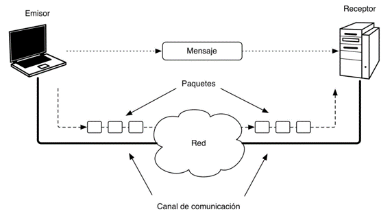
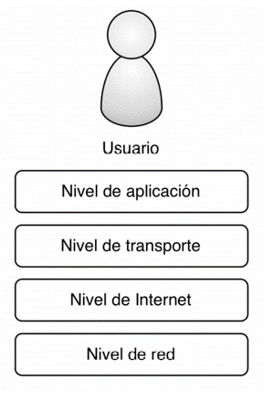
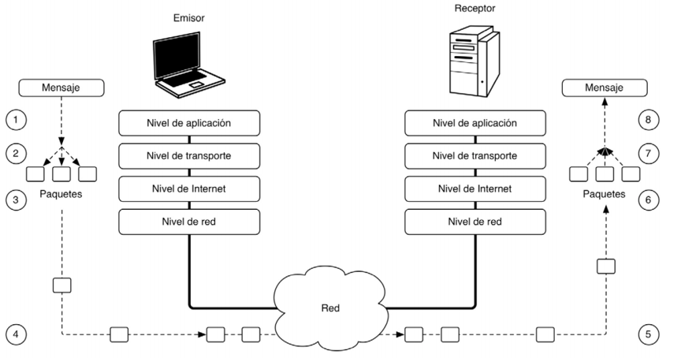
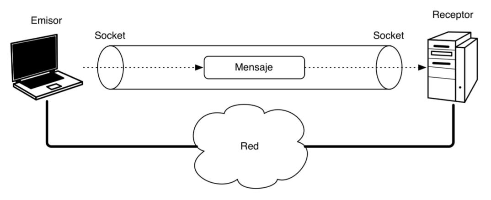
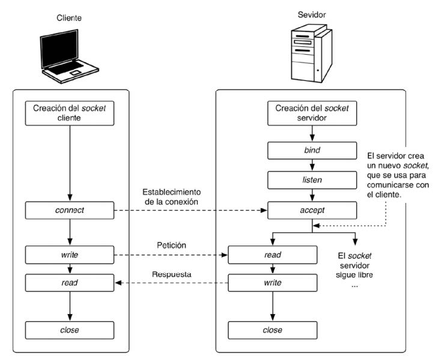
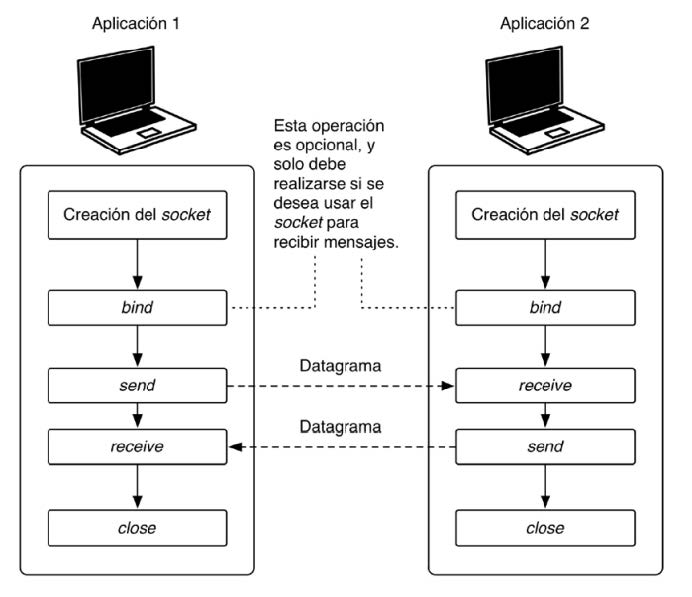
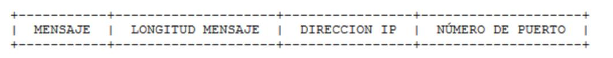
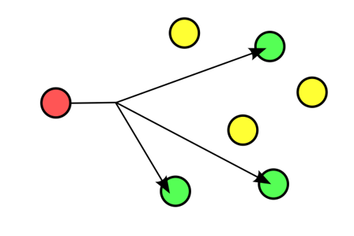

# UD3 - Programación de comunicaciones en red

- [UD3 - Programación de comunicaciones en red](#ud3---programación-de-comunicaciones-en-red)
  - [1. Fundamentos de la programación de comunicaciones en red](#1-fundamentos-de-la-programación-de-comunicaciones-en-red)
    - [Protocolos de comunicación](#protocolos-de-comunicación)
    - [TCP](#tcp)
    - [UDP](#udp)
    - [IP](#ip)
    - [Elementos de la comunicación](#elementos-de-la-comunicación)
  - [2. Clases y librerías para la comunicación en red](#2-clases-y-librerías-para-la-comunicación-en-red)
    - [InetAddress](#inetaddress)
    - [SocketsAddress](#socketsaddress)
    - [InetSocketAddress](#inetsocketaddress)
    - [ServerSocket](#serversocket)
    - [Socket](#socket)
    - [DatagramPacket](#datagrampacket)
    - [DatagramSocket](#datagramsocket)
  - [3. Comunicación mediante sockets](#3-comunicación-mediante-sockets)
    - [Sistemas basados en sockets TCP](#sistemas-basados-en-sockets-tcp)
    - [Sistemas basados en sockets UDP](#sistemas-basados-en-sockets-udp)
  - [4. Comunicación multihilo con sockets](#4-comunicación-multihilo-con-sockets)
    - [MulticastSocket](#multicastsocket)
    - [Comunicación multihilo](#comunicación-multihilo)
    - [Envío de objetos a través de sockets TCP](#envío-de-objetos-a-través-de-sockets-tcp)
    - [Envío de objetos a través de sockets UDP](#envío-de-objetos-a-través-de-sockets-udp)

## 1. Fundamentos de la programación de comunicaciones en red
La mayoría de sistemas computacionales de la actualidad siguen el modelo de computación distribuida. Aplicaciones a través de Internet, móviles, etc.

Un **sistema distribuido** está formado por más de un elemento computacional distinto e independiente (un procesador dentro de una máquina, un ordenador dentro de una red, etc) que no comparte memoria con el resto. 
- Los elementos que forman el sistema distribuido no están sincronizados: No hay reloj común.
- Los elementos que forman el sistema están conectados a una red de comunicaciones.

Para hacer posible la comunicación entre sistemas informáticos tienen que existir los siguientes elementos:  
- Mensaje: Es la información que se intercambia entre las aplicaciones que se comunican.
- Emisor: Es la aplicación que envía el mensaje. 
- Receptor: Es la aplicación que recibe el mensaje. 
- Paquete: Es la unidad básica de información que intercambian dos dispositivos de comunicación.
- Canal de comunicación: Es el medio por el que se transmiten los paquetes, que conecta el emisor con el receptor. 
- **Protocolo de comunicaciones**: Es el conjunto de reglas que fijan cómo se deben intercambiar paquetes entre los diferentes elementos que se comunican entre sí. 

El conjunto de protocolos sobre los que se construye internet se conoce como **familia de protocolos de internet**. Estos protocolos abarcan todo tipo de servicios, desde la web hasta el correo electrónico. Una de sus ventajas más interesantes es que son **protocolos abiertos**, lo que quiere decir que no pertenecen a ninguna empresa u organización, pudiendo disponer de ellos de manera libre y gratuita. 

Los principales protocolos para la comunicación entre ordenadores son IP, TCP y UDP. Estos protocolos son la base de las comunicaciones de internet y dan soporte a protocolos del nivel superior como HTTP y FTP.

Para implementar esto en Java utilizamos **sockets**, que permiten utilizar los protocolos mencionados. Mediante sockets podemos establecer un canal de comunicación entre dos puntos para el envío y recepción de datos en los dos sentidos.

### Protocolos de comunicación
Para comunicar las aplicaciones que forman un sistema distribuído son necesarios elementos de hardware y software organizados en lo que conocemos como pila de protocolos. La pila de protocolos de comunicación tiene las siguientes capas:

- **Nivel de red**: Lo componen los elementos hardware de comunicaciones y sus controladores básicos. Se encarga de trasmitir los paquetes de información. 
- **Nivel de Internet**: Lo componen los elementos software que se encargan de dirigir los paquetes por la red, asegurándose de que lleguen a su destino. También llamado nivel IP.
- **Nivel de transporte**: Lo componen los elementos software cuya función es crear el canal de comunicación, descomponer el mensaje en paquetes y gestionar su transmisión entre el emisor y el receptor. 
Los dos protocolos de transporte fundamentales: TCP y UDP. 
- **Nivel de aplicación**: Lo componen las aplicaciones que forman el sistema distribuido, que hacen uso de los niveles inferiores para poder transferir mensajes entre ellas.

Los protocolos con los que vamos a trabajar en esta unidad son los siguientes:
| Protocolo | Capa en el protocolo TCP/IP   |
| ----------| ----------                    |
| TCP       | Capa de transporte            |
| UDP       | Capa de transporte            |
|IP         | Capa de internet              |

### TCP
Protocolo de control de transmisión (Transmission Control Protocol o TCP) es un protocolo de Internet ubicado en la capa de transporte. TCP garantiza la entrega de paquetes al distinatario de forma ordenada, completa y correcta. Se utiliza, por ejemplo, en la transferencia de archivos FTP, porque porque garantiza el envío de la información. Este protocolo se basa en conexiones, cuando establece una conexión entre dos nodos de la red se crea un canal por el que se envía la información.

### UDP
El protocolo de datagramas de usuario (User Datagram Protocol o UDP) es un protocolo del nivel de transporte basado en la transmisión sin conexión de datagramas y representa una alternativa al protocolo TCP. Permite el envío de datagramas de forma rápida en redes IP sin establecer previamente una conexión, dado que el propio datagrama incorpora la información sobre el destinatario.

### IP
El protocolo de internet (Internet Protocol o IP) es un protocolo de comunicación de datos digitales que encontramos en la capa de red. Su función principal es el uso bidireccional para transmitir datos mediante un protocolo de transporte (TCP o UDP).

### Elementos de la comunicación

- Servidor: conjunto de hardware y software que proporciona un servicio en una red. Por ejemplo, las páginas web son proporcionadas por un servidor web.
- Cliente: consumidor de un servicio. Puede ser hardware o software. Por ejemplo, un navegador web.
- Host: es un equipo que funciona como extremo de una comunicación, aunque normalmente suele utilizarse para hacer referencia al proveedor (servidor).
- Canal: medio por el que se transmite la información. Aire, fibra óptica, cable de cobre, etc.
- Protocolo: descripción formal de cualquiera de las actividades que tienen lugar en la comunicación.
- Mensaje: información que se transmite entre interlocutores.
- Paquete: llamamos paquete de red o de datos a cada uno de los fragmentos de un mensaje que se envían por la red.
- Datagrama: paquete de datos que constituye la unidad mínima de información transmitible.
- Dirección: identificador del dispositivo o recurso de un elemento de una red. Por ejemplo, la dirección IP identifica un dispositivo mientras que la dirección web identifica un recurso en la web.
- Puerto: extremo de una comunicación. Se identifica con un número de 16 bits que es el número del puerto y se asocia a una dirección IP. Un dispositivo puede tener tantos canales de comunicación como puertos.

Algunos puertos están reservados para servicios específicos. Los puertos inferiores al 1024 son puertos conocidos. Los puertos con números altos, entre 49152 y 65535, están disponibles para su uso, puertos efímeros.

Algunos de los puertos conocidos más importantes son:
- 21, FTP
- 22, SSH
- 23, Telnet
- 25, SMTP
- 80, HTTP
- 443, HTTPS

Puedes consiltar la lista completa de puertos conocidos en el siguiente enlace: [https://es.wikipedia.org/wiki/Anexo:Puertos_de_red](https://es.wikipedia.org/wiki/Anexo:Puertos_de_red).

Todas las aplicaciones que permiten trabajar en red necesitan utilizar uno o más puertos. Habitualmente tienen asociado un puerto por defecto. Por ejemplo, MySQL utiliza el puerto 3306, aunque normalmente el puerto al que se asocia un servicio se puede modificar.

## 2. Clases y librerías para la comunicación en red
Las clases de Java que necesitamos para realizar aplicaciones en red, están recogidas en el paquete **java.net**.

### InetAddress
La primera clase que vamos a ver es la clase **InetAddress**, que representa una dirección IP. Los principales métodos de esta clase son:

| Método         | Descripción                   |
| ----------     | ----------                    |
| getAddress     | Proporciona la dirección IP representada por el objeto InnetAddress como un array de bytes. |
| getByAddress   | Proporciona un objeto InetAddress a partir de una IP representada como un array de bytes. |
| getByName      | Método estático que proporciona la IP de un host a partir de su nombre. |
| getHostAddress | Proporciona la IP en modo texto del objeto InetAddress |
| getHostName    | Proporciona el nombre de host para la direcciñon del objeto InetAddress |
| getLocalHost   | Proporciona la IP del localhost |

> Ejemplo 1: Realiza un programa en Java que admita desde la línea de comandos un nombre de máquina o una dirección IP y visualice información sobre ella.

### SocketsAddress
Clase abstracta que representa la dirección de un socket.

### InetSocketAddress
Subclase de SocketsAddress que representa la dirección del socket mediante una IP y un puerto.

### ServerSocket
En java.net tenemos las clases **ServerSocket** (para el servidor) y **Socket** (para el cliente).

El cliente solicita una conexión y el servidor la acepta. Después de la conexión se puede transmitir datos en ambas direcciones.

Constructores de ServerSocket:	
- ServerSocket(int port): Crea un socket para escuchar por peticiones de conexión en el puerto especificado. La fila de espera para peticiones de conexiones se establece en 50.
- ServerSocket(int port,int maximo): Crea un socket servidor en el puerto especificado. La fila de espera para peticiones de conexiones se establece en máximo.

La fila de espera es para poder manejar peticiones de conexión en forma simultánea o cuando lleguen peticiones antes de que se termine de procesar la que llego antes.

Métodos relevantes de la clase ServerSocket:
| Método        | Descripción                   |
| ----------    | ----------                    |
| accept        | Recibe las peticiones de establecimiento de conexión, proporcionando un socket. |
| bind          | Asocia el ServerSocket a una dirección. |
| close         | Cierra el socket. |
| isBound       | Devuelve el estado de asociación del socket. |
| isConnected   | Determina si el socket está conectado. |

### Socket
Un socket es un estremo en la comunicación entre dos máquinas.

Métodos más imporotantes de la clase socket:
| Método        | Descripción                   |
| ----------    | ----------                    |
| bind          | Asocia el socket a una dirección local. |
| close         | Cierra el socket. |
| connect       | Conecta el socket con el servicor. |
| getInputStream | Proporciona un stream de lectura. |
| getOutputStream | Proporciona un stream de escritura. |
| isBound       | Devuelve el estado de asociación del socket. |
| isClosed      | Determina si el socket está cerrado. |
| isConnected   | Determina si el socket está conectado. |

### DatagramPacket
Incluye constructores que permiten crear un array de bytes que determinen el contenido del paquete a enviar.
- DatagramPacket(byte[],int): Especifica la cadena de bytes donde se aloja el mensaje y la longitud del dicha cadena.
- DatagramPacket(byte[], int,InetAddress, int): Especifica la cadena de bytes donde se aloja el mensaje, la longitud de la cadena, la dirección IP y el puerto al que se enviael mensaje.

Métodos más importantes: 
| Método        | Descripción                   |
| ----------    | ----------                    |
| getAddress()  | Devuelve la IP del host que envió el datagrama. |
| getData()     | Devuelve el mensaje contenido en el datagrama. |
| getLength()   | Devuelve la longitud de datos del datagrama. |
| getPort()     | Devuelve el número de puerto del datagrama. |

### DatagramSocket
Representa un socket para el envío y recepción de datagramas. Los métodos más importantes de esta clase son:
| Método        | Descripción                   |
| ----------    | ----------                    |
| bind          | Asocia el socket a una dirección local. |
| close         | Cierra el socket. |
| connect       | Conecta el socket con el servicor. |
| disconnect    | Desconecta el socket con el servicor. |
| isBound       | Devuelve el estado de asociación del socket. |
| isClosed      | Determina si el socket está cerrado. |
| isConnected   | Determina si el socket está conectado. |
| receive       | Recibe un datagrama del socket. |
| send          | Envía un datagrama a través del socket. |

## 3. Comunicación mediante sockets
Los sockets son un mecanismo de comunicación de bajo nivel. Permiten intercambiar información entre los elementos de una red utilizando protocolos TCP y UDP. Para desarrollar aplicaciones basadas en sockets son necesarias varias clases del paquete java.net para la comunicación y de java.io para la lectura y escritura de bytes.

El desarrollo de aplicaciones con sockets es diferentes si se utiliza protocolo TCP o UDP.

### Sistemas basados en sockets TCP

Opera en tres fases:
1. Establecimiento de la conexión mediante un stream con la IP y la dirección del puerto.
2. Envío de mensajes.
3. Cierre de la conexión.

> Ejemplo 2: Realiza un programa servidor TCP que acepte dos clientes. Muestra por cada cliente conectado sus puertos local y remoto.
> 
> Crea también el programa cliente que se conecte a ese servidor. Muestra los puertos locales y remotos a los que está conectado su socket, y la dirección IP de la máquina remota a la que se conecta.

> Ejemplo 3: Escribe un programa servidor que recibe un mensaje del cliente y lo muestra por pantalla. Después envía un mensaje al cliente y este lo muestra por pantalla.

> Hoja de ejercicios 1: sockets TCP

### Sistemas basados en sockets UDP
Es un protocolo NO orientado a conexión. Esto lo hace más rápido que TCP, ya que no es necesario establecer conexiones, etc.
- No garantiza que los mensajes lleguen siempre pero permite controlar los datos enviados en cada paquete.
- No garantiza que los mensajes lleguen en el mismo orden que fueron enviados.
- Permite enviar mensajes de 64 KB como máximo.
- En UDP, los mensajes se denominan “datagramas” (datagrams en ingles).
- Cuando se usan sockets datagram no existe diferencia entre proceso-servidor y proceso-cliente.

Pasos para enviar mensajes:
- Creación del socket.
- Asignación de dirección y puerto (bind). Solo necesaria para poder recibir mensajes.
- Envío y/o recepción de mensajes.
- Cierre del socket.

Cuando se envían datagramas el emisor debe indicar explícitamente la dirección IP y el puerto
El datagrama tiene los siguientes campos:

>  Ejemplo 4: Utilizando sockets UDP, programa un servidor que reciba un datagrama de un cliente, y muestre información: numero de bytes recibidos, contenido del paquete,ip y puerto de origen y de destino del paquete. El cliente envía un mensaje saludando y muestra la información del datagrama: longitud, host destino, ip de destino,puerto local y puerto de destino.

> Ejemplo 5: Utilizando sockets UDP, donde el servidor reciba un string del cliente y devuelve el numero de letras "a" minúsculas que tiene dicho string. El cliente envía un datagrama con un string y muestra la respuesta del servidor.

> Hoja de ejercicios 2: sockets UDP

## 4. Comunicación multihilo con sockets

Se usan **Multicast Sockets** para enviar paquetes a múltiples destinos simultáneamente. Para ello se establece un grupo multicast, que es un grupo de direcciones IP con el mismo puerto. Al enviar el mensaje lo reciben todos los del grupo pero el emisor no sabe qué equipos del grupo lo gan recibido ni sus IP.

### MulticastSocket
La clase MulticastSocket se utiliza para enviar y recibir paquetes de multidifusión IP. Un MulticastSocket es un DatagramSocket (UDP), con capacidades adicionales para unirse a "grupos" de otros hosts de multidifusión en Internet.

Un grupo de multidifusión se especifica mediante una dirección IP de clase D (direcciones de red de 32 bits) y un número de puerto UDP estándar. Las direcciones IP de Clase D están en el rango 224.0.0.0 a 239.255.255.255, inclusive. La dirección 224.0.0.0 está reservada y no debe utilizarse.

### Comunicación multihilo

Para realizar comunicación multihilo mediante sockets necesitamos que los servidores sean capaces de atender a muchos clientes a la vez. 

El esquema básico en sockets TCP es construir el servidor solo con la clase ServerSocket e invocar el accept. Con el socket que devuelve el accept se crea un hilo para atender a ese cliente.

Normalmente los servidores multihilo se programan en un bucle infinito.

> Ejemplo 9: servidor multihilo.

### Envío de objetos a través de sockets TCP
Se pueden intercambiar objetos entre un programa cliente y un programa servidor. Para ello utilizaremos las clases **ObjectInputStream** y **ObjectOutputStream**. Se usan los métodos **readObject** y **writeObject**.

> Ejemplo 7: intercambio de objetos con sockets TCP

### Envío de objetos a través de sockets UDP

Se pueden intercambiar objetos entre un programa cliente y un programa servidor. Utilizaremos las clases **ByteArrayOutputStream** y **ByteArrayInputStream**. Para enviarlo tenemos que convertir el objeto en array de bytes.

> Ejemplo 8: Ver ejemplo de intercambio de objetos con sockets UDP
