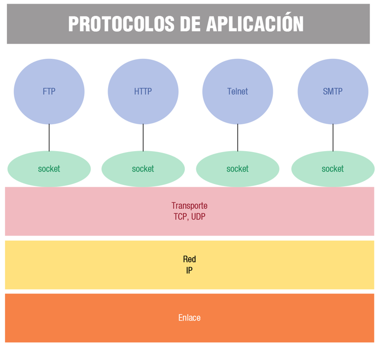
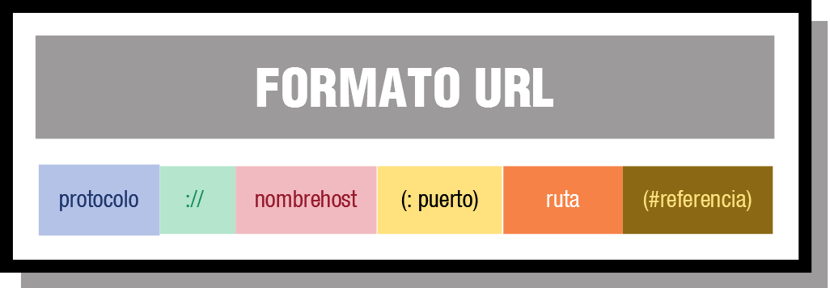

# UD4 - Generación de servicios en red

- [UD4 - Generación de servicios en red](#ud4---generación-de-servicios-en-red)
  - [1. Protocolos de comunicación en red a nivel aplicación](#1-protocolos-de-comunicación-en-red-a-nivel-aplicación)
  - [2. Clases y librerías para la creación de servicios en red](#2-clases-y-librerías-para-la-creación-de-servicios-en-red)
    - [java.net.URL](#javaneturl)
    - [java.net.URLConnection](#javaneturlconnection)
    - [java.net.HttpURLConnection](#javanethttpurlconnection)
    - [java.net.http.HttpClient](#javanethttphttpclient)
  - [Transferencia de archivos mediante FTP](#transferencia-de-archivos-mediante-ftp)
    - [java.net.http.HttpResponse](#javanethttphttpresponse)
    - [FTPClient](#ftpclient)
    - [JavaMail](#javamail)


## 1. Protocolos de comunicación en red a nivel aplicación
Una __red informática__ es un sistema de comunicaciones que conecta ordenadores y otros equipos informáticos entre sí, con la finalidad de compartir información y recursos.

Ventajas:
- Reducción en el presupuesto para software y hardware.
- Posibilidad de organizar grupos de trabajo.
- Mejoras en la administración de los equipos y las aplicaciones.
- Mejoras en la integridad de los datos.
- Mayor seguridad para acceder a la información.
- Mayor facilidad de comunicación.

Los __servicios__ son programas auxiliares que se usan en un sistema de computadoras para gestionar una serie de recursos y prestar una funcionalidad a usuarios y aplicaciones.
- Ejemplo: servicio de impresión, servicio de correo, servicio de almacenamiento…

Los servicios se implementan con una relación cliente-servidor. Usaremos Java para programar los clientes de los servicios más utilizados.

En el tema anterior trabajamos en el nivel de transporte conectándonos con sockets del protocolo TCP y del protocolo UDP. En este tema trabajaremos en el nivel de aplicación. En este nivel nos encontramos los siguientes protocolos: SMTP, TELNET, FTP, HTTP, NFS, SNMP, DNS…





- HTTP

El Protocolo de transferencia de hipertexto (Hypertext Transfer Protocol) es el protocolo de comunicación que permite las transferencias de documentos a través de internet. Para funcionar se basa en el protocolo TCP.

HTTP es un protocolo basado en el principio cliente-servidor: las peticiones son enviadas por una entidad: el agente del usuario (o un proxy a petición de uno). La mayoría de las veces el agente del usuario (cliente) es un navegador Web, pero podría ser cualquier otro programa.

Para trabajar con el protocolo HTTP es necesario conocer las peticionenes que se pueden realizar que se ven en la siguiente tabla:

| Método        | Descripción                   |
| ----------    | ----------                    |
| GET           | Solicita la recuperación de un recurso. Una petición HTTP que utiliza este método recupera una entidad alojada en el servidor. |
| POST          | Crea una entidad alojada en el servidor. |
| PUT           | Crea una entidad alojada en el servidor o actualiza una existente. |
| DELETE        | Elimina una entidad alojada en el servidor. |

También es importante conocer los códigos de respuesta a las peticiones HTTP. Estos códigos nos dan información sobre el resultado de la petición.

| Códigos       | Descripción                   |
| ----------    | ----------                    |
| 100-199       | Respuesta informativa. | 
| 200-299       | Éxito. | 
| 300-399       | Redirercción. | 
| 400-499       | Error del cliente. | 
| 500-599       | Error del servidor. | 

Dos de los códigos más frecuentes son:
- 200: la solicitud ha tenido éxito.
- 404: el recurso solicitadono ha sido encotrado.

El protocolo HTTP utiliza por defecto el puerto 80.

- HTTPS

El Protocolo seguro de transferencia de hipertexto (Hypertext Transfer Protocol Secure) es un protocolo de aplicación basado en el protocolo HTTP, destinado a la transferencia segura de datos de hipertexto, es decir, es la versión segura de HTTP. Este protocolo cifra toda la información intercambiada entre cliente y servidor.

El protocolo HTTPS utiliza por defecto el puerto 443.

- FTP

El Protocolo de transferencia de archivos (File Transfer Protocol) es un protocolo para la transferencia de archivos entre sistemas. Está basado en la arquitectura cliente-servidor y utiliza el protocolo TCP.

Utiliza por defecto el puerto 21.

- SMTP

El protocolo para transferencia simple de correo (Simple Mail Transfer Protocol) es un protocolo de red utilizado para el intercambio de mensajes de correo electrónico. 

Utiliza por defecto el puerto 25.

- IMAP

El protocolo de acceso a mensajes de Internet (Internet Message Access Protocol), es un protocolo de aplicación que permite el acceso a mensajes almacenados en un servidor de Internet. Mediante IMAP se puede tener acceso al correo electrónico desde cualquier equipo que tenga una conexión a Internet.

Utiliza por defecto el puerto 143 para conexiones no cifradas y el 993 para conexiones cifradas.

- POP3

El protocolo Post Office Protocol (POP3, Protocolo de Oficina de Correo o "Protocolo de Oficina Postal") se utiliza en clientes locales de correo para obtener los mensajes de correo electrónico almacenados en un servidor remoto, denominado Servidor POP. 

POP3 descarga los correos y los elimina del servidor, por lo que una vez vistos no podrán consultarse desde otros equipos.

Con el protocolo IMAP el usuario no descarga los correos electrónicos que recibe en el dispositivo a través del cual está accediendo al servidor cloud en ese momento. En el caso de POP3, el usuario sí descarga los correos en el dispositivo en el que tenga configurada su cuenta.

Ambos sistemas tienen sus ventajas y desventajas. El IMAP no consume espacio del dispositivo ya que los correos se reciben y leen online, sin necesidad de descargarlos. No obstante, la gran ventaja que presenta POP3 es que el usuario puede descargar todos sus correos electrónicos en un dispositivo y leerlos posteriormente, sin necesidad de tener conexión a Internet.

Utiliza por defecto el puerto 110 para conexiones no cifradas y el 995 para conexiones cifradas.

- DNS

El sistema de nombres de dominio (Domain Name System)​ es un sistema de nomenclatura jerárquico descentralizado para dispositivos conectados a redes IP. Permite vincular una URL o una dirección de correo a la IP donde se aloja el servicio.

Utiliza por defecto el puerto 53.

- TELNET

Telnet (Teletype Network1​) es un protocolo que nos permite acceder a otra máquina para manejarla remotamente. No cifra la información.

Utiliza por defecto el puerto 23.

- SSH

SSH (o Secure SHell, en español: intérprete de órdenes seguro) es un protocolo que permite acceder en remoto a un equipo desde una terminal. Es un protocolo en el que la información va cifrada.

Utiliza por defecto el puerto 22.

- LDAP

El protocolo ligero de acceso a directorios (Lightweight Directory Access Protocol) es un protocolo a nivel de aplicación que permite el acceso a un servicio de directorio ordenado y distribuido para buscar diversa información en un entorno de red. Se suele utilizar prara almacenar la información de acceso a los sistemas (credenciales y permisos).

Utiliza por defecto el puerto 389.

- NFS

El sistema de archivos en red (Network File System) permite enviar y consultar ficheros en una red desde cualquiera de sus nodos.

Utiliza por defecto el puerto 2049.

- SNMP

El Protocolo simple de administración de red (Simple Network Management Protocol) es un protocolo de la capa de aplicación que facilita el intercambio de información de administración entre dispositivos de red. Los dispositivos que normalmente soportan SNMP incluyen routers, switches, servidores, estaciones de trabajo, impresoras, bastidores de módem y muchos más. Permite a los administradores supervisar el funcionamiento de la red, buscar y resolver sus problemas, y planear su crecimiento.

Utiliza por defecto el puerto 161.

- DHCP

El protocolo de configuración dinámica de host (Dynamic Host Configuration Protocol) es un protocolo cliente/servidor​ mediante el cual un servidor DHCP asigna dinámicamente una dirección IP y otros parámetros de configuración de red a cada dispositivo en una red para que puedan comunicarse con otras redes IP.

Utiliza por defecto el puerto 67.

> Clasifica los protocolos anteriores en seguros y no seguros.

## 2. Clases y librerías para la creación de servicios en red

Java se ha construido con extensas capacidades de interconexión TCP/IP y soporta diferentes niveles de conectividad en red, facilitando la creación de aplicaciones cliente/servidor y generación de servicios en red.

El paquete principal que proporciona el API de Java para programar aplicaciones con comunicaciones en red es __java.net__, que soporta clases para generar diferentes servicios de red, servidores y clientes.

La programación de URL se produce a un nivel más alto que la programación de sockets y esto, puede facilitar la creación de aplicaciones que acceden a recursos de la red.

### java.net.URL

Una URL, Localizador Uniforme de Recursos, representa una dirección a un recurso de la web. Un recurso puede ser algo tan simple como un archivo o un directorio, o puede ser una referencia a un objeto más complicado, como una consulta a una base de datos, el resultado de la ejecución de un programa, etc.

La estructura de una URL se puede dividir en varias partes:



- Protocolo. El protocolo que se usa para comunicar.
- Nombrehost. Nombre del host que proporciona el servicio o servidor.
- Puerto. El puerto de red en el servidor para conectarse. Si no se especifica, se utiliza el puerto por defecto para el protocolo.
- Ruta. Es la ruta o path al recurso en el servidor.
- Referencia. Es un fragmento que indica una parte específica dentro del recurso especificado.

la construcción de objetos de esta clase se realiza de la siguiente manera: 
```Java
URL url = new URL("https://www.google.com")
```
Pueden lanzar la excepción MalformedURLException si la URL está mal construida, no se hace ninguna verificación de que realmente exista la máquina o el recurso de red.

El método _openConnection_ es uno de los más importantes de la clase URL. Este método devuelve un objeto URLConnection que representa la conexión a un objeto remoto referenciado por la URL.

### java.net.URLConnection

URLConnection es la superclase de todas las clases que representan un enlace de comunicación entre la aplicación y la URL. Las instancias de esta clase permiten leer y escribir en el recurso referenciado por la URL.

Los métodos más importantes son:

| Método                | Descripción                   |
| ----------            | ----------                    |
| getByName             | Proporciona la IP de un host desde su nombre. |
| getLocalHost          | Proporciona la IP del localhost. |
| getHostAddress        | Proporciona la IP del host. |
| getHostName           | Proporciona el nombre del host. |
| getAddress            | Proporciona la IP del host como un array de bytes. |
| getCannonicalHostName | Proporciona el nombre del host. |
| getInputStream        | Proporciona un stream de lectura. |
| getOutputStream       | Proporciona un stream de escritura. |
| setRequestProperty    | Asigna el valor de una propiedad. |

> Ejemplo1: Crea un programa en el que se crea una URL para http://www.eldiariomontanes.es:80/index.html#descargas y analiza con los métodos vistos de URL.

> Ejemplo2: Al programa le pasamos una dirección http y muestra por pantalla los campos de cabecera de la respuesta. Si el contenido de la url es de tipo texto o pdf, nos lo tendrá que descargar en un fichero en local

### java.net.HttpURLConnection
Utilizaremos esta clase para gestionar una conexión HTTP.

| Método                | Descripción                   |
| ----------            | ----------                    |
| disconnect            | Desconecta la conexión. |
| getResponseCode       | Proporciona el código de retorno HTTP enviado por el servidor. |
| setRequestMethod      | Proporciona el método de petición. |

Contiene también las ocnstantes que representan los códigos de estado del protocolo HTTP, como, por ejemplo, HttpURLConnection.HTTP_OK que tiene el valor entero 200 y que significa que la petición se ha realizaco correctamente (OK).

> Hoja de ejercicios 2 -> Peticiones HTTP basadas en _HttpUrlConnection_

### java.net.http.HttpClient
Esta clase permite realizar peticiones HTTP y obtener sus respuestas. Las instancias deben crearse a través de la instancia a un objeto o de un builder.

Principales métodos de HttpClient:

| Método                | Descripción                   |
| ----------            | ----------                    |
| newBuilder            | Crea un builder (objeto de la interfaz _HttpClient.Builder_). |
| send                  | Envía una petición HTTP y devuelve una instancia de HttpResponse. Recibe como parámetro, además de la petición, un ubjeto de la clase HttpResponse.BodyHandles, encargado de gestionar el contenido de la respuesta de la petición. |

Principales métodos de HttpClient.Builder:
| Método                | Descripción                   |
| ----------            | ----------                    |
| build                 | Proporciona el objeto HttpClient con la configuración proporcionada. |
| followsRedirect       | Proporciona mecanismos para determinar cómo debe comportarse la petición frente a las redirecciones del servidor. |
| version               | Permite especificar la versión del protocolo HTTP. |


## Transferencia de archivos mediante FTP

| Clase | Descripción |
| ----------            | ----------                    |
| FTP | Proporciona la funcionalidad necesaria para implementar un cliente FTP. |
| FTPClient	| Esta es la clase principal que representa al cliente FTP. Permite conectarse a un servidor FTP, enviar y recibir archivos, y ejecutar comandos FTP. |
| FTPFile	| Esta clase representa un archivo en un servidor FTP. Proporciona información sobre el archivo, como su nombre, tamaño y fecha de modificación. |
| FTPFileFilter	| Esta interfaz define un filtro para los archivos que se reciben de un servidor FTP. Los objetos que implementan esta interfaz pueden usarse para filtrar archivos basados en su nombre, tamaño o cualquier otra propiedad. |
| FTPReply	| Esta clase enumera todas las respuestas posibles que puede enviar un servidor FTP en respuesta a un comando FTP. Cada respuesta tiene un código numérico y una descripción textual. |
| FTPConnectionClosedException	| Esta excepción se lanza cuando se intenta realizar una operación en un servidor FTP que ha cerrado la conexión. |

La clase FTPClient de la biblioteca Apache Commons Net es una clase de utilidad que permite a los desarrolladores de Java interactuar con servidores FTP (Protocolo de transferencia de archivos).

FTPClient proporciona una interfaz de programación de aplicaciones (API) que permite a los desarrolladores cargar y descargar archivos, navegar por el sistema de archivos del servidor FTP, renombrar y eliminar archivos, crear y eliminar directorios, y mucho más.

| Método	| Descripción |
| ----------            | ----------                    |
| connect(String hostname)	| Conecta el cliente FTP al servidor especificado por su nombre de host. | 
| login(String username, String password)	Inicia sesión en el servidor FTP con el nombre de usuario y contraseña especificados. |
| logout() |	Cierra la sesión actual en el servidor FTP. |
| changeWorkingDirectory(String pathname)	| Cambia el directorio de trabajo actual del servidor FTP al directorio especificado. |
| storeFile(String remote, InputStream local) |	Carga un archivo en el servidor FTP desde un flujo de entrada de datos local. |
| retrieveFile(String remote, OutputStream local)	| Descarga un archivo del servidor FTP a un flujo de salida de datos local. |
| listFiles(String pathname) |	Devuelve un array de objetos FTPFile que representan los archivos en el directorio especificado. |
| deleteFile(String pathname)	| Elimina el archivo especificado del servidor FTP. |
| sendSiteCommand(String arguments)	| Envía un comando del sitio FTP al servidor FTP. |

### java.net.http.HttpResponse

> Hoja de ejercicios 3 -> Peticiones HTTP basadas en _java.net.http_

### FTPClient


> Hoja de ejercicio 4 -> Transferencia de ficheros mediente HTTP

### JavaMail


> Hoja de jercicios 5 -> Envío y resepción de correos electrónicos


