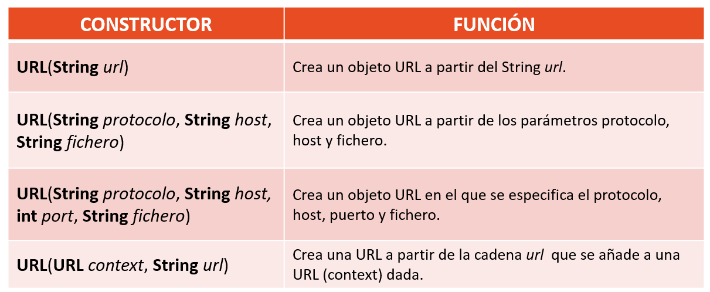
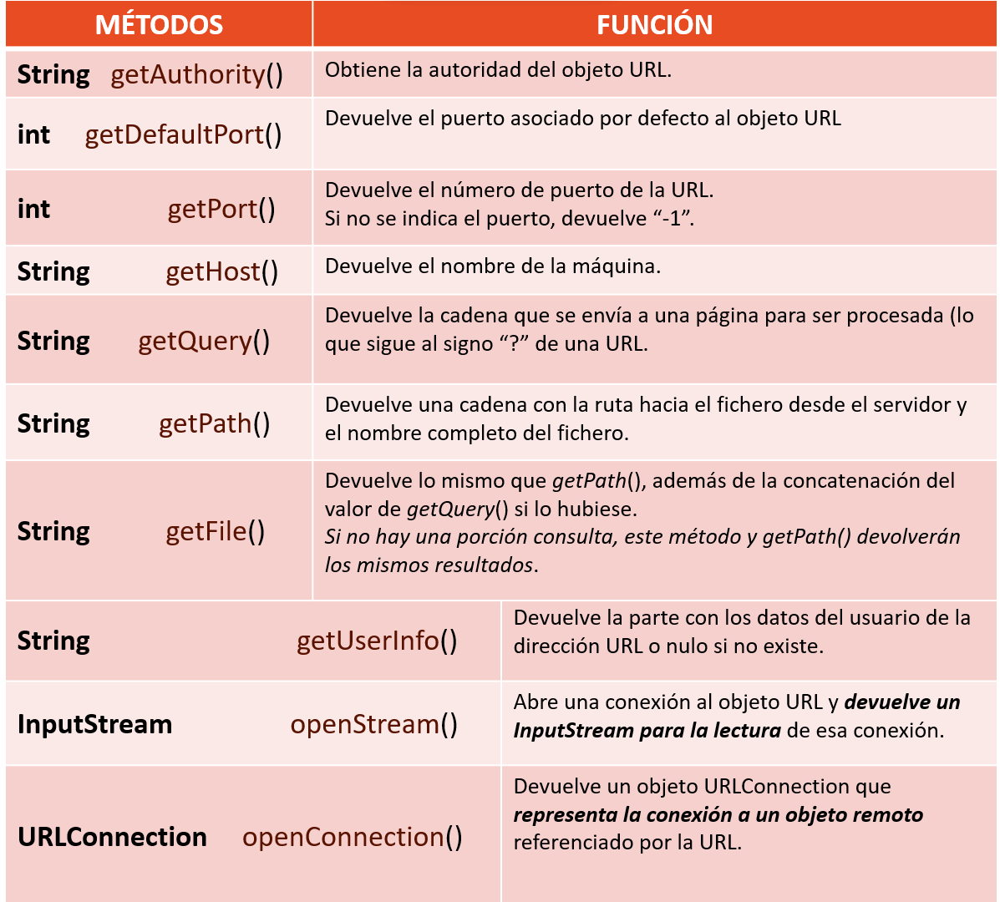

# Generación de servicios en red

- [Generación de servicios en red](#generación-de-servicios-en-red)
  - [1. Protocolos estándar de comunicación en res a nivel aplicación](#1-protocolos-estándar-de-comunicación-en-res-a-nivel-aplicación)
  - [2. Clases y librerías para la creación de servicios en red](#2-clases-y-librerías-para-la-creación-de-servicios-en-red)
    - [URL y URLConnection](#url-y-urlconnection)
  - [3. Comunicación HTTP](#3-comunicación-http)
    - [3.1. Peticiones HTTP basadas en _HttpUrlConnection_](#31-peticiones-http-basadas-en-httpurlconnection)
    - [3.1. Peticiones HTTP basadas en _java.net.http_](#31-peticiones-http-basadas-en-javanethttp)
  - [4. Transferencia de ficheros mediente HTTP](#4-transferencia-de-ficheros-mediente-http)
  - [5. Envío y resepción de correos electrónicos](#5-envío-y-resepción-de-correos-electrónicos)
  - [6. Programación distribuída](#6-programación-distribuída)

## 1. Protocolos estándar de comunicación en res a nivel aplicación
Una __red informática__ es un sistema de comunicaciones que conecta ordenadores y otros equipos informáticos entre sí, con la finalidad de compartir información y recursos.
Ventajas:
- Reducción en el presupuesto para software y hardware.
- Posibilidad de organizar grupos de trabajo.
- Mejoras en la administración de los equipos y las aplicaciones.
- Mejoras en la integridad de los datos.
- Mayor seguridad para acceder a la información.
- Mayor facilidad de comunicación.

Los __servicios__ son programas auxiliares que se usan en un sistema de computadoras para gestionar una serie de recursos y prestar una funcionalidad a usuarios y aplicaciones.
- Ejemplo: servicio de impresión, servicio de correo, servicio de almacenamiento…

Los servicios se implementan con una relación cliente-servidor. Usaremos Java para programar los clientes de los servicios más utilizados.

En el tema anterior trabajamos en el nivel de transporte conectándonos con sockets del protocolo TCP y del protocolo UDP. En este tema trabajaremos en el nivel de aplicación. En este nivel nos encontramos los siguientes protocolos: SMTP, TELNET, FTP, HTTP, NFS, SNMP, DNS…

- HTTP

El Protocolo de transferencia de hipertexto (Hypertext Transfer Protocol) es el protocolo de comunicación que permite las transferencias de documentos a través de internet. Para funcionar se basa en el protocolo TCP.

HTTP es un protocolo basado en el principio cliente-servidor: las peticiones son enviadas por una entidad: el agente del usuario (o un proxy a petición de uno). La mayoría de las veces el agente del usuario (cliente) es un navegador Web, pero podría ser cualquier otro programa.

Para trabajar con el protocolo HTTP es necesario conocer las peticionenes que se pueden realizar que se ven en la siguiente tabla:

| Método        | Descripción                   |
| ----------    | ----------                    |
| GET           | Solicita la recuperación de un recurso. Una petición HTTP que utiliza este método recupera una entidad alojada en el servidor. |
| POST          | Crea una entidad alojada en el servidor. |
| PUT           | Crea una entidad alojada en el servidor o actualiza una existente. |
| DELETE        | Elimina una entidad alojada en el servidor. |

También es importante conocer los códigos de respuesta a las peticiones HTTP. Estos códigos nos dan información sobre el resultado de la petición.

| Códigos       | Descripción                   |
| ----------    | ----------                    |
| 100-199       | Respuesta informativa. | 
| 200-299       | Éxito. | 
| 300-399       | Redirercción. | 
| 400-499       | Error del cliente. | 
| 500-599       | Error del servidor. | 

Dos de los códigos más frecuentes son:
- 200: la solicitud ha tenido éxito.
- 404: el recurso solicitadono ha sido encotrado.

El protocolo HTTP utiliza por defecto el puerto 80.

- HTTPS

El Protocolo seguro de transferencia de hipertexto (Hypertext Transfer Protocol Secure) es un protocolo de aplicación basado en el protocolo HTTP, destinado a la transferencia segura de datos de hipertexto, es decir, es la versión segura de HTTP. Este protocolo cifra toda la información intercambiada entre cliente y servidor.

El protocolo HTTPS utiliza por defecto el puerto 443.

- FTP

El Protocolo de transferencia de archivos (File Transfer Protocol) es un protocolo para la transferencia de archivos entre sistemas. Está basado en la arquitectura cliente-servidor y utiliza el protocolo TCP.

- SMTP

El protocolo para transferencia simple de correo (Simple Mail Transfer Protocol) es un protocolo de red utilizado para el intercambio de mensajes de correo electrónico. 

- IMAP

El protocolo de acceso a mensajes de Internet (Internet Message Access Protocol), es un protocolo de aplicación que permite el acceso a mensajes almacenados en un servidor de Internet. Mediante IMAP se puede tener acceso al correo electrónico desde cualquier equipo que tenga una conexión a Internet.

- POP3

El protocolo Post Office Protocol (POP3, Protocolo de Oficina de Correo o "Protocolo de Oficina Postal") se utiliza en clientes locales de correo para obtener los mensajes de correo electrónico almacenados en un servidor remoto, denominado Servidor POP. 

POP3 descarga los correos y los elimina del servidor, por lo que una vez vistos no podrán consultarse desde otros equipos.

Con el protocolo IMAP el usuario no descarga los correos electrónicos que recibe en el dispositivo a través del cual está accediendo al servidor cloud en ese momento. En el caso de POP3, el usuario sí descarga los correos en el dispositivo en el que tenga configurada su cuenta.

Ambos sistemas tienen sus ventajas y desventajas. El IMAP no consume espacio del dispositivo ya que los correos se reciben y leen online, sin necesidad de descargarlos. No obstante, la gran ventaja que presenta POP3 es que el usuario puede descargar todos sus correos electrónicos en un dispositivo y leerlos posteriormente, sin necesidad de tener conexión a Internet.

- DNS

El sistema de nombres de dominio (Domain Name System)​ es un sistema de nomenclatura jerárquico descentralizado para dispositivos conectados a redes IP. Permite vincular una URL o una dirección de correo a la IP donde se aloja el servicio.

- TELNET

Telnet (Teletype Network1​) es un protocolo que nos permite acceder a otra máquina para manejarla remotamente. No cifra la información.

- SSH

SSH (o Secure SHell, en español: intérprete de órdenes seguro) es un protocolo que permite acceder en remoto a un equipo desde una terminal. Es un protocolo en el que la información va cifrada.

- LDAP

El protocolo ligero de acceso a directorios (Lightweight Directory Access Protocol) es un protocolo a nivel de aplicación que permite el acceso a un servicio de directorio ordenado y distribuido para buscar diversa información en un entorno de red. Se suele utilizar prara almacenar la información de acceso a los sistemas (credenciales y permisos).

- NFS

El sistema de archivos en red (Network File System) permite enviar y consultar ficheros en una red desde cualquiera de sus nodos.

- SNMP

El Protocolo simple de administración de red (Simple Network Management Protocol) es un protocolo de la capa de aplicación que facilita el intercambio de información de administración entre dispositivos de red. Los dispositivos que normalmente soportan SNMP incluyen routers, switches, servidores, estaciones de trabajo, impresoras, bastidores de módem y muchos más. Permite a los administradores supervisar el funcionamiento de la red, buscar y resolver sus problemas, y planear su crecimiento.

- DHCP

El protocolo de configuración dinámica de host (Dynamic Host Configuration Protocol) es un protocolo cliente/servidor​ mediante el cual un servidor DHCP asigna dinámicamente una dirección IP y otros parámetros de configuración de red a cada dispositivo en una red para que puedan comunicarse con otras redes IP.

## 2. Clases y librerías para la creación de servicios en red

Java se ha construido con extensas capacidades de interconexión TCP/IP y soporta diferentes niveles de conectividad en red, facilitando la creación de aplicaciones cliente/servidor y generación de servicios en red.

El paquete principal que proporciona el API de Java para programar aplicaciones con comunicaciones en red es __java.net__, que soporta clases para generar diferentes servicios de red, servidores y clientes.

### URL y URLConnection

La programación de URL se produce a un nivel más alto que la programación de sockets y esto, puede facilitar la creación de aplicaciones que acceden a recursos de la red.

Una URL, Localizador Uniforme de Recursos, representa una dirección a un recurso de la World Wide Web. Un recurso puede ser algo tan simple como un archivo o un directorio, o puede ser una referencia a un objeto más complicado, como una consulta a una base de datos, el resultado de la ejecución de un programa, etc.

La estructura de una URL se puede dividir en varias partes:

- Protocolo. El protocolo que se usa para comunicar.
- Nombrehost. Nombre del host que proporciona el servicio o servidor.
- Puerto. El puerto de red en el servidor para conectarse. Si no se especifica, se utiliza el puerto por defecto para el protocolo.
- Ruta. Es la ruta o path al recurso en el servidor.
- Referencia. Es un fragmento que indica una parte específica dentro del recurso especificado.

Construcciores de la clase URL:

Pueden lanzar la excepción MalformedURLException si la URL está mal construida, no se hace ninguna verificación de que realmente exista la máquina o el recurso de red.

Métodos de la clase URL:

> Ejemplo 1: Crea un programa en el que se crea una URL para http://www.eldiariomontanes.es:80/index.html#descargas y analiza con los métodos vistos de URL. (1.-URLprueba)

## 3. Comunicación HTTP
Para generar servicios basados en HTTP hay que trabajar en dos enfoques, el de cliente y el de servidor. En esta asignatura vamos a ver el enfoque del cliente con el objetivo de desarrollar aplicacioes que realicen peticiones HTTP para obtener información.

### 3.1. Peticiones HTTP basadas en _HttpUrlConnection_

### 3.1. Peticiones HTTP basadas en _java.net.http_

## 4. Transferencia de ficheros mediente HTTP

## 5. Envío y resepción de correos electrónicos

## 6. Programación distribuída

