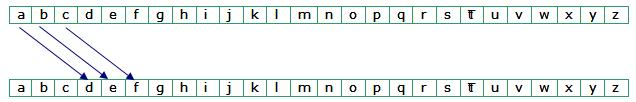
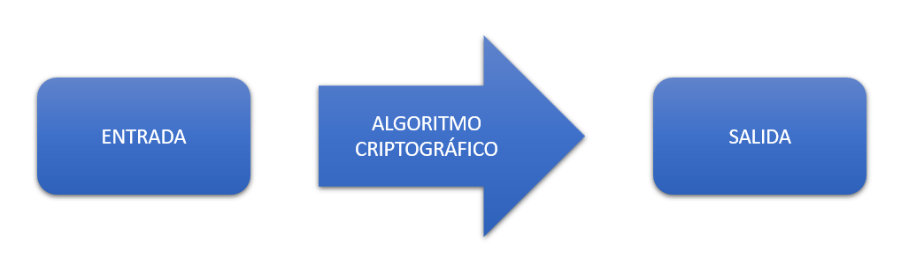

# UD5 - Técnicas de programación segura

- [UD5 - Técnicas de programación segura](#ud5---técnicas-de-programación-segura)
  - [Introducción a la criptografía](#introducción-a-la-criptografía)
  - [Principales aplicaciones de la criptografía.](#principales-aplicaciones-de-la-criptografía)
  - [Protocolos criptográficos.](#protocolos-criptográficos)
  - [Algoritmos criptográficos](#algoritmos-criptográficos)
    - [Algoritmos HASH o de resumen](#algoritmos-hash-o-de-resumen)
    - [Algoritmos de clave privada](#algoritmos-de-clave-privada)
    - [Algoritmos de clave pública](#algoritmos-de-clave-pública)

## Introducción a la criptografía
Las aplicaciones informáticas permiten gestionar e intercambiar de forma automatizada una gran cantidad de información en formato digital. En ocasiones esta información pueden ser datos sensibles que deban tratarse de forma segura. Pueden ser desde datos bancarios u hospitalario hasta correos electrónicos personales de los que se quiera garantizar que no son falsos y que sólo usted los podrá leer. Por tanto, es importante poder garantizar seguridad en los datos que gestionan nuestras aplicaciones.

Una de las herramientas fundamentales para garantizar esa seguridad es la criptografía.

La __criptografía__ (escritura secreta) se encarga de estudiar cómo transformar unos datos para garantizar su seguridad ante posibles ataques.

La criptografía tiene una base con gran carga matemática pero, desde el punto de vista de un desarrollador, lo que hace es poner a su disposición un conjunto de algoritmos de transformación de datos. Cuando se aplica un algoritmo criptográfico, los datos originales son lo que se llama __datos en claro__ . Mediante un algoritmo, éstas se transforman y se obtiene como resultado los datos protegidos, o texto cifrado . Con el algoritmo correspondiente, se puede invertir el proceso.

Muchos algoritmos se basan en claves criptográficas.

Una __clave criptográfica__ es un conjunto de información que se usa como parámetro de un algoritmo criptográfico y que afecta al proceso de transformación de los datos. El algoritmo sólo producirá una salida correcta, tanto al cifrar como al descifrar, si se utiliza la clave adecuada.

Dependiendo del tipo de clave que usa un algoritmo criptográfico, cada uno se clasifica entre dos tipos, de __clave simétrica__ y __asimétrica (o pública)__. En el primer tipo, existe una única clave criptográfica, llamada clave secreta, que se distribuye entre todas las entidades que deben poder acceder libremente a los datos. En cambio, en segundo caso, se utilizan dos claves, una llamada privada (o secreta) y otra llamada pública. La secreta sólo la conoce una de las entidades, mientras que la pública puede conocerla todo el mundo, ya que se distribuye libremente sin que implique ningún peligro.

Normalmente, los algoritmos criptográficos se usan para realizar dos tareas: para cifrar o firmar digitalmente los datos.

> Ver vídeo: [Cómo funciona la criptografía](https://www.youtube.com/watch?v=Q8K311s7EiM)

> Ejemplo1: Cifrado césar.
> Desarrolla en Java un sistema criptográfico mediante cifrado César.
> 
> Supondremos que el texto solo contiene letras mayúsculas o minúsculas. La letras serán las correspondientes al alfabeto inglés (26 caracteres, excluimos la ñ y Ñ).
> 
> En este método de cifrado cada letra del texto se sustituye por otra letra que se encuentra N posiciones adelante en el alfabeto. Se considera que el alfabeto es circular, es decir, la letra siguiente a la ‘z’ es la ‘a’.
> 
> Por ejemplo, si N es 3, la ‘a’ se transformaría en ‘d’, la ‘b’ en ‘e’, la ‘c’ en ‘f’, etc.
> 
> 
> 
> Ejemplo de cifrado César: si el texto es “casa” y N = 3 el texto cifrado es “fdvd”
> 
> El programa pedirá por teclado un texto, a continuación el valor de N y si queremos codificar o decodificar el texto. Finalmente se mostrará el texto resultante.

Normalmente los sistemas criptográficos tienen que cumplir unas características comunes. Las más improtantes son:
- Confidencialidad: solo pueden tener acceso a la información las personas o sistemas autorizados.
- Integridad: la información gestionada poor el sistema critográfico debe permanecer íntegra, sin sufrir pérdidas ni alteraciones.
- Autenticación: se debe poder verificar la identidad de los participantes en el sistema.
- Vinculación: debe disponer de mecanismos para que el creador o emisor de información no pueda negar su autoría.

Estas características no es obligatorio que se cumplane en todos los sistemas criptográficos, existen sistemas que requieren incumplir expresamente alguna de las carcterísticas anteriores.

En resumen, todos los procesos criptográficos funcional igual. A una entrada le aplicamos la ejecución de un algoritmo criptográfico y se produce una salida.

## Principales aplicaciones de la criptografía.
Mensajería segura: todo el mundo da su clave de cifrado pero conserva la de descifrado. Si queremos enviar un mensaje a alguien cogemos su clave de cifrado y ciframos el mensaje que le enviamos. Solo él podrá descifrarlo.

Firma digital: es pilar del comercio electrónico. Permite verificar que un archivo no ha sido modificado.

Mensajería segura: en este tipo de mensajería se intenta evitar que un atacante consiga descifrar nuestros mensajes.

Autenticación: los sistemas de autenticación intentan resolver una cuestión clave en la informática: verificar que una máquina es quien dice ser.

## Protocolos criptográficos.
Exisnten muchos protocolos criptográficos y suelen dividirse en sistemas simétricos o asimétricos.

Los __sistemas simétricos__ son aquellos basados en una función que convierte un mensaje en otro mensaje cifrado. Si se desea descifrar algo se aplica el proceso inverso con la misma clave que se usó.

Los __sistemas asimétricos__ utilizan una clave de cifrado y otra de descifrado. Aunque se tenga una clave es matemáticamente imposible averiguar la otra clave por lo que se puede dar a todo el mundo una de las claves (llamada habitualmente clave pública) y conservar la otra (llamada clave privada). Además, podemos usar las claves para lo que queramos y por ejemplo en unos casos cifraremos con la clave pública y en otros tal vez cifremos con la clave privada.

Hoy por hoy, las mayores garantías las ofrecen los asimétricos, de los cuales hay varios sistemas. El inconveniente que pueden tener los asimétricos es que son más lentos computacionalmente.

## Algoritmos criptográficos
Dependiendo del objetivo del sismeta criptográfico vamos a utilizar un algoritmo diferente. Existen tres tipos,algoritmos HASH o de resumen, algoritmos de clave privada y algoritmos de clave pública.

### Algoritmos HASH o de resumen
Estos algoritmos generan como saluda un resumen de los datos de entrada. la salida no equivale en tamaño ni en contenido a la entrada.

Los algoritmos hash  son de vital importancia en la firma digital ya que garantizan la integridad de los datos.

Los algoritmos HASH tienen que cumplir las siguientes características:
- Tamaño de salida constante, depende del algoritmo.
- Irreversible: dado un resumen, no permite obtener la entrada que lo generó. 
- Ausencia de colisiones: son más robustos porque no existen con dos entradas distintas que generen el mismo resumen.

> Prueba el funcionamiento de un algoritmo HASH utilizando una web de resumen de informacción. Resumir con SHA3(256) en https://herramientas-online.com/generador-hash-online.html, prueba a introducir tres mensajes de diferente longitud y comprueba la longitud del código criptográfico de la salida.

### Algoritmos de clave privada

### Algoritmos de clave pública